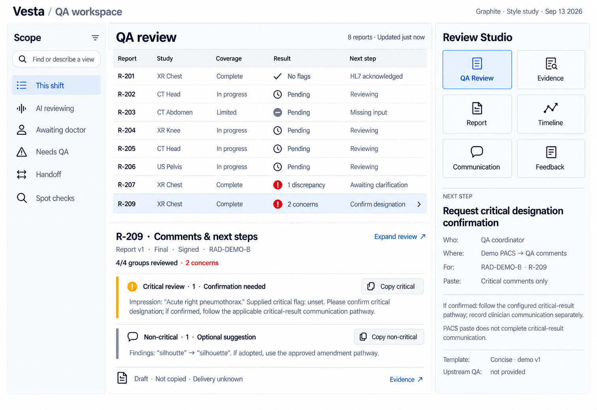
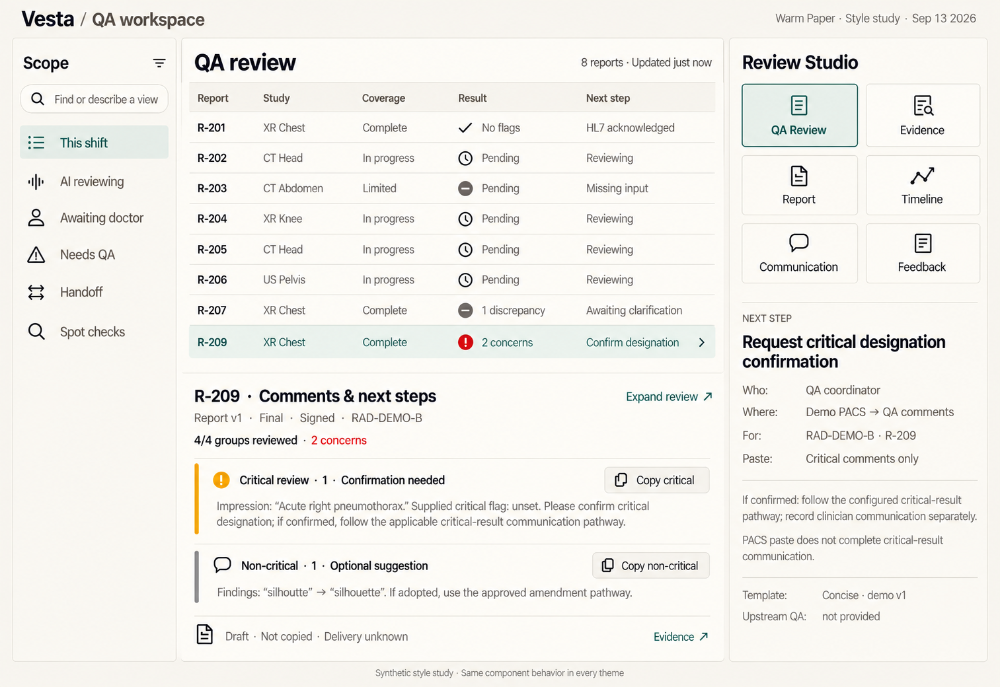
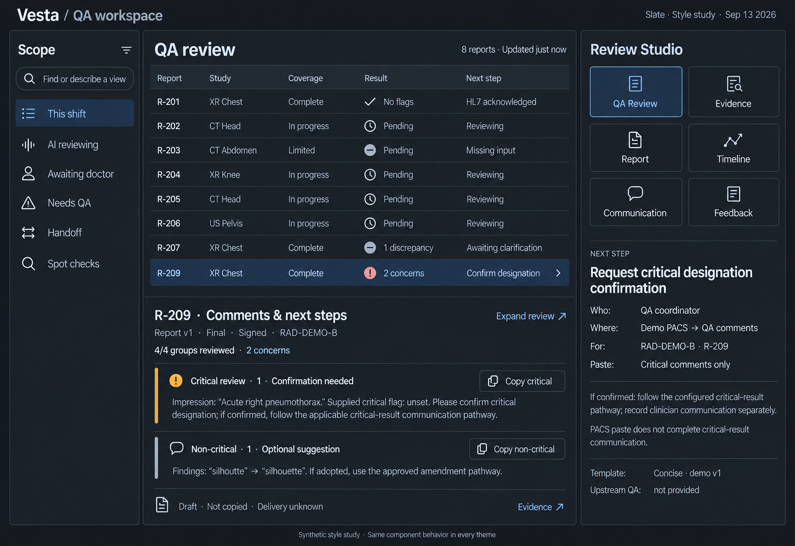

> Next-build authority (2026-09-17): [clean-start foundation plan](../prototype/FOUNDATION_PLAN.md). This broader framework is a design reference, not extra foundation scope. Preserve the current application's history, feedback, analytics and tenant drafts. Fresh data and one-call DBOS execution supersede older implementation assumptions; historical examples are not new runtime or clinical evidence.

# Vesta QA design system — v0.2

13 September 2026 · Supports framework v1.2. **Selected direction:** Linear-inspired fleet-first center, Attio-inspired compact vertical Studio, and concise contextual guidance. The existing Graphite semantic palette is the initial token baseline. Framework contracts remain v1.2; this is a visual-system revision, not an application implementation.

## 1. Product character

Quiet, precise and responsive. The interface's identity comes from typography, density, alignment, a consistent three-panel structure and prominent comments/next steps. Color communicates selection or attention. It does not decorate each check group, agent, report stage or tool.

The two review modes are settled requirements: compact comments and guidance immediately on selection, then one-click expanded detail. A theme change cannot reintroduce a Comments tab, change the case state or hide the next action.

## 2. Selected direction and earlier studies

| Direction | Appearance | Intended trade-off | Recommendation |
|---|---|---|---|
| Graphite | White and cool-gray surfaces, charcoal text, small blue accent | Familiar light operational UI; restrained distinction through typography and compact controls | Selected token baseline; apply the approved fleet/Studio composition |
| Warm Paper | Warm off-white surfaces, charcoal text, deep teal accent | A warmer document-centered appearance; needs review on actual team displays | Alternative visual direction |
| Slate | Dark charcoal surfaces, pale text, soft blue accent | Useful as a user preference; contrast and report-source rendering require their own checks | Optional later theme, not an assumed productivity improvement |

### Graphite

### Warm Paper

### Slate

These are generated style studies, not exact pixel specifications. The Graphite image incorrectly gives R-207 a red issue icon; R-207 is a non-critical discrepancy in the fixture and must use neutral styling. Study images also use oversized Studio tiles and some colored aggregate counts: implementation uses the compact component sizes and neutral counts below. The current compact reference is the approved combined composition. The retained lavender expanded image specifies behavior only, not the final palette or Studio layout. Semantic tokens and component contracts govern implementation.

## 3. Semantic color roles

| Role | Usage |
|---|---|
| Canvas / surface / subtle surface | Background and grouping, using near-neutral values |
| Text / muted text | Reading hierarchy; muted text must remain readable |
| Separator | Decorative boundaries; not the sole sign of an interactive control |
| Control border | Identifies buttons/fields when their boundary is needed |
| Accent / selection / focus | Active tool, selected row, link and keyboard focus; one accent family per theme |
| Attention | Unresolved routing, missing prerequisite or critical designation needing confirmation; always labeled |
| Urgent | A policy-backed immediate attention state, not every discrepancy or every finding count |

Routine progress, completed checks, ordinary discrepancies and optional suggestions are neutral text with a label/icon. A critical-review candidate is explicitly “Confirmation needed”; it is not visually presented as a confirmed diagnosis. An urgent cue follows the configured routing policy, independently of confirmation. Never infer urgency from finding type alone. Avoid large saturated backgrounds and permanently flashing indicators.

`design-tokens.json` and `design-tokens.css` contain the same three theme palettes and shared spacing/type/motion tokens. Tokens are proposed design inputs, not a claim that every rendered component meets accessibility requirements.

## 4. Type, spacing and density

- Use the operating system sans-serif stack; no downloaded font is needed initially. Body and comment text: 14–16px with about 1.45–1.55 line height. Supporting metadata: 12–13px. Keep clinical comment text readable at zoom.
- Use 4px spacing increments: 4, 8, 12, 16, 24, 32. Use alignment and 1px separators before introducing boxes. Small 4–6px radii; no nested card stacks.
- Proposed desktop widths: Scope 192–224px, Studio 280–320px, center fills the remainder. At smaller widths, collapse secondary panels deliberately; do not squeeze the report text into unreadable columns.
- Fleet rows start around 40–44px. Studio uses six compact icon/text selectors in one vertical list, with 32–36px desktop targets and adequate spacing. Buttons are usually 32–36px high on desktop with accessible target spacing; touch layouts use larger targets.
- The compact selected-case area aims for no more than about 40% of available center height at the reference viewport. It may grow or use explicit expansion when text size/content requires. Never shrink fonts to enforce a ratio.

## 5. Component behavior contract

| Component | Default / interaction | Distinctive behavior |
|---|---|---|
| FleetRow | Neutral row; one click selects and opens compact comments | Stable identity and selection; focused row does not jump when other cases update |
| ReviewHeader | Case/version/author/signature; small coverage/outcome line | Source identity stays visible across tools and modes |
| CommentSection | Critical or non-critical heading, count, concise exact text, small copy control | No tab; shared identity shown once; expansion never rewrites the packet |
| ExpandReview | Single explicit button with expanded state | One click reveals supporting detail; collapse restores fleet position |
| ReviewDetail | Internal QA Brief, typed findings, limits and relevant evidence | Supports the deliverable; never precedes comments as the default landing |
| EvidencePair | Source version/location and exact quote/value | Open source context without substituting another version |
| StudioTool | Small icon/text selector with selected indicator | Six stable tools; controls select views, not external actions |
| NextStep | Concrete verb, actor, destination/field, dependency and completion cue | Operator guidance is excluded from copied radiologist text |
| CopyControl | Copy named section; exact preview available | Success only after clipboard success; does not mark delivery or acceptance |
| ActionControl | Label says the actual effect: record, request, send, or verify | Availability is supplied by authority/state; local optimism cannot establish clinical completion |
| Status / notice | Short text, optional icon and restrained semantic cue | Meaning remains clear without color; stale/disconnected context stays visible |

Use semantic buttons for actions and links for navigation; tool selection exposes its selected state. Copying announces a concise result near the control and through an appropriate status region. If copying is unavailable, offer selectable plain text. A toast alone is insufficient for a persistent failure or unresolved prerequisite.

## 6. Motion and browser cost

Most of the interface should be still. Selection and focus can change immediately. Optional hover/selection color transition: 100–120ms. Optional content appearance: at most 150ms. Expand/collapse can switch layout immediately; do not animate a whole fleet's height. No continuous pulse, per-row spinner fleet, shimmer, scan beams, autoplay replay, backdrop blur or canvas/WebGL scene.

Respect reduced-motion preference with immediate state changes. If animation is useful, favor narrowly scoped opacity/transform effects and measure their actual rendering cost. Guidance from [web.dev's animation guide](https://web.dev/articles/animations-guide) supports avoiding unnecessary layout/paint work; it does not prove this unbuilt interface is fast.

Visual restraint alone does not guarantee performance. Rendering/subscription boundaries and source loading are defined in UI_SYSTEM_DESIGN.md.

## 7. Accessibility and validation

Color must not be the only way to communicate state or identify an action; use labels and clear selected/focus indicators. This follows [W3C guidance on use of color](https://www.w3.org/WAI/WCAG22/Understanding/use-of-color.html).

Target readable text and control contrast, keyboard access, visible focus, zoom/reflow and reduced motion. Check theme token contrast mathematically now; test real component states and task completion in the later prototype. Do not label a theme compliant from token checks alone. Do not claim dark mode reduces fatigue without testing it with users.

## 8. First implementation slice

Implement the selected neutral light theme, the existing three-panel shell, 20-row synthetic fleet, compact comments, one-click detail and contextual next step. Add source inspection and simulated copy/status handling. Preserve all framework distinctions. Theme switching is not a prerequisite for the first prototype; the alternate palettes remain design studies until selected.

## 9. Approved composition — 13 September 2026

Fleet remains above the Selected-report workspace. Compact comments appear immediately below the fleet; expanding reveals supporting assessment and evidence without rewriting the comment packet. Studio is a vertical text/icon tool list followed by contextual guidance. QA Review opens comments; internal QA Brief appears in expanded detail. Evidence provides exact source/version/location proof; Report displays the source document. These are distinct purposes.

The primary contextual action states its real effect. “Record PACS paste” opens a recording flow; it must not itself assert delivery or communication completion. Only record after the operator supplies the required completion evidence.

Generated-reference dimensions are illustrative: do not copy oversized navigation widths or Studio row spacing literally. Apply the compact sizes in section 4, preserve readable comments and support zoom. The approved image demonstrates eight rows; validate 10–20 concurrent studies in a later prototype.

The accepted inspiration is a composition and interaction direction, not an official Linear or Attio design system. No frontend stack is selected. Motion and performance targets remain unverified until implementation.
