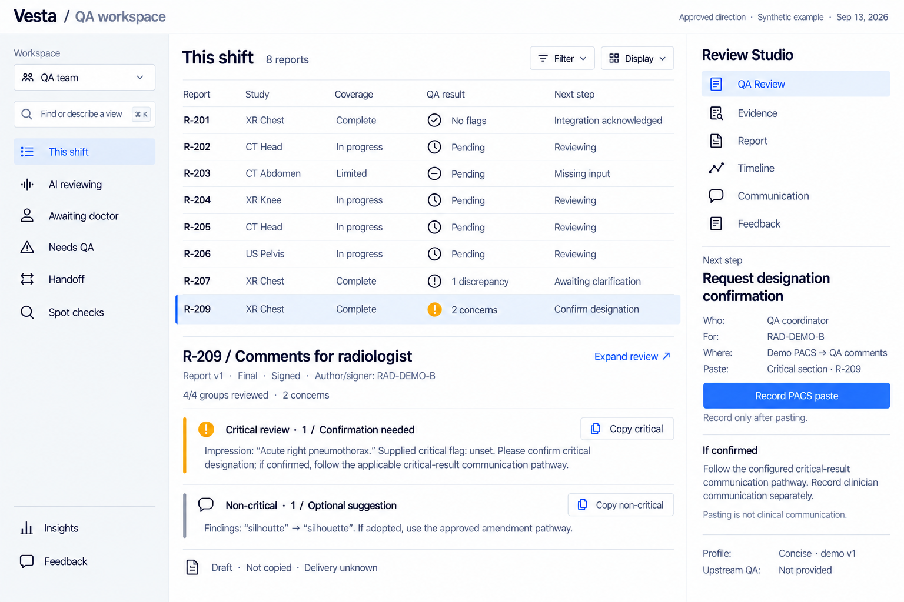
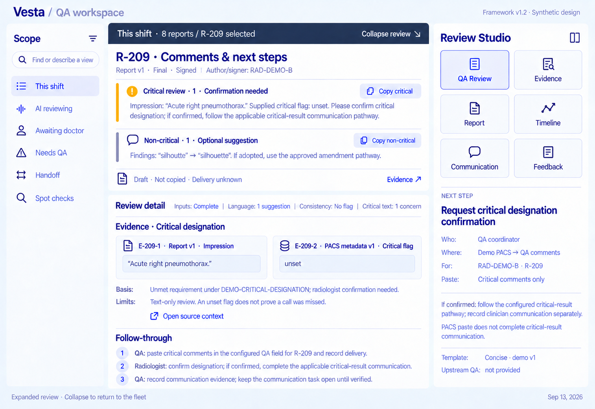

> Next-build authority (2026-09-17): [clean-start foundation plan](../prototype/FOUNDATION_PLAN.md). This broader framework is a design reference, not extra foundation scope. Preserve the current application's history, feedback, analytics and tenant drafts. Fresh data and one-call DBOS execution supersede older implementation assumptions; historical examples are not new runtime or clinical evidence.

# Autonomous report QA — UX framework blueprint

Version 1.2 · 13 September 2026 · Vesta Teleradiology

**Status:** design baseline for review and subsequent development. This is a UX framework, not a validated clinical system, a release policy, or an implementation specification for AI agents.

## 1. Purpose and reading order

Help non-clinical QA staff supervise report review, inspect evidence, coordinate specialist decisions, and verify follow-through. Routine work proceeds autonomously within configured authority. People can understand what happened and what needs them without inspecting every report.

Read this document first. Then read `DECISIONS.md` for decisions, assumptions and open questions; `QA_COMMENTS.md` for radiologist-facing output and `GUIDED_ACTIONS.md` for contextual next steps; `AGENT_HANDOFF.md` for implementation boundaries and acceptance criteria; and `fixtures.json` for three synthetic examples. `comment-packets.json` and `comment-examples/` contain structured and plain-text outputs. `assets/reference-ui.png` is the current visual anchor. `BLUEPRINT.html` is the portable reading edition with the image embedded. `REVISION_REVIEW.md` records this revision's consistency review. `DESIGN_SYSTEM.md` defines three restrained style studies and component behavior; `UI_SYSTEM_DESIGN.md` defines state, rendering and integration boundaries. These extend the UX handoff without selecting a production stack.

**Authority order:** explicit subsequent user decisions → agreed framework decisions → proposed framework defaults → fixture examples → reference image. Image wording and fictional values never establish clinical policy. Record a conflict rather than silently inventing a resolution.

## 2. Scope and boundaries

The main workflow begins when a radiologist completes a report and ends at a confirmed handoff to the configured outbound integration, such as an HL7 interface. Completion is an intake event, not an assumption that the report is signed. Retain authorship, document status and signature status with each source version. It does not establish delivery to, reading by, or acceptance by the facility. What constitutes a successful integration acknowledgement remains connector-specific.

Review uses report text and available supporting context, including a facility tech sheet when relevant. It may identify language issues, internal contradictions, contextual discrepancies, and potential critical findings described in the text. It does not interpret images or establish the correct clinical diagnosis. If a finding is absent from every available input, retain later feedback as an upstream concern rather than automatically classifying it as an AI report-review miss.

Radiologists remain the decision owners for clinical clarification. Initial report edits may occur manually in another system. External messaging can carry questions and decisions; the QA workspace records the exchange and its outcome. A voice integration can eventually coordinate communication, but connecting a call and completing the required clinical conversation are different events.

Feedback can arrive after outbound handoff. Its arrival does not erase the original review, automatically recall a report, or automatically train a model.

**Not in this framework release:** image analysis, production connectors, backend/API architecture, agent orchestration, autonomy policy editors, bulk interventions, recovery consoles, shared incident management, model evaluation infrastructure, or automated learning. Preserve room for these without building them now.

## 3. Six stable foundations

| ID | Foundation | Required behavior |
|---|---|---|
| F1 | Stable panel responsibilities | Scope on the left; QA work in the center; specialized views and contextual actions in Studio. |
| F2 | Connected information | Cases, source versions, checks, findings, decisions, actions, messages and feedback have explicit relationships. |
| F3 | Separate states | Review coverage, QA outcome, human dependencies and outbound handoff do not collapse into one completion badge. |
| F4 | Inspectable evidence | Actionable findings identify their source, location, basis and limitations. |
| F5 | Clear responsibility | Show who acts next, what is permitted, and whether an action is proposed, performed or verified. |
| F6 | Preserved context | Switching views preserves case selection, filters and fleet position; live updates do not steal focus. |

## 4. Workspace structure

### Left: Scope

Purpose: answer **which work am I looking at?** Provide saved views, explicit filters and report selection where appropriate. Natural-language filtering is optional convenience; always expose the resulting editable criteria. A misunderstood query must not silently broaden the selection. Manual filters must work without an AI service.

Proposed views: This shift, AI reviewing, Awaiting doctor, Needs QA, Handoff and Spot checks. Counts may overlap and must not be summed as a partition. Define each view's time range and predicates. “This shift” may contain completed reports; “Active” excludes terminal cases unless a documented unresolved dependency keeps them active. A supervisor must still have a visible indication of urgent work outside the current filter; the escalation criteria are not defined here.

### Center: QA work

Purpose: answer **what was reviewed, what was found, and what happens next?** The default fleet view is a stable report list. Suggested columns are report identity/exam, coverage, QA outcome, next step and waiting time. Keep full waiting age and responsible party accessible even when a compact layout hides a column.

One row per case; do not partition the workspace into stages. Four stable check groups are proposed: Inputs/context, Language, Consistency, and Critical findings in text. Specific checks expand within these groups. Counts describe completed applicable checks or groups, never confidence or safety. Failed or skipped checks do not count as completed review coverage.

The lower center area is the **Selected-report workspace**, a container with a persistent case/source-version/author/signature header and an explicit active-view label. On selection, immediately open **QA Review — Comments & next steps in compact mode**. Comments are the principal QA deliverable and require no extra tab or tool click. Show critical/non-critical sections with concise actionable text, a small coverage/outcome line, and context-specific guidance in Studio. Selecting a new case resets to this compact default and clears the previous finding/packet/action context. Report is an explicit source-inspection tool, not the initial landing view.

**Compact mode** preserves fleet space. Use flat comment rows, small copy controls and one shared case/version header, rather than large nested cards, repeated identity lines or a full internal assessment. At the reference desktop size, aim for about 60% of center height for fleet work and about 40% or less for the selected-case overview. These are proposed proportions, not fixed pixels; readable comments, urgent context and accessibility take precedence. Show real comments, not just counts or generic issue labels.

**Expand review** is one click. It gives the center to the same case, retains comments first, and reveals detailed assessment, evidence and full follow-through below. Keep Scope and Studio familiar, with a slim fleet-context strip and **Collapse review** control. Collapse restores the prior fleet scroll, filter, selection and compact content. Expand/collapse changes presentation only; it neither reruns QA nor changes comment wording, versions or workflow state. Do not require another click to make the detail appear after expansion.

**QA Review** leads with radiologist comments and contextual next steps in both modes. The internal **QA Brief** is supporting assessment in expanded Review detail, not a competing tab or a separate landing screen. **Evidence** shows proof for a selected finding/check, with exact source version and context. **Report** shows the source document. Direct Evidence and Report inspection remain available without navigating through a review tab.

### Right: Review Studio

Purpose: answer **how can I inspect or progress the selected work?** Use six stable tools in a compact, fixed order. These controls select views and do not themselves modify external state.

| Tool | Content | Primary scope |
|---|---|---|
| QA Review | Default: compact comments and next-step overview. Expanded: the same comments plus assessment, evidence and follow-through. | Case; selected comment section |
| Evidence | Exact source passages, structured fields, comparisons, basis and limitations | Selected finding/check |
| Report | Snapshot or full source document; authorship/signature and version comparison when available | Case/source version |
| Timeline | Recorded checks, decisions, communications, actions and handoff events | Case |
| Communication | Delivery records, linked external messages, response interpretation and outstanding exchanges; not the QA comment composer | Case/decision |
| Feedback | Feedback records, provenance, review status and resolution | Finding/action/case |

The active tool controls the Selected-report workspace. Studio does not duplicate the entire document or QA summary. QA Review has compact and expanded presentation modes, keeping the palette at six tools; remove Brief/Comments tabs. Below the palette, show one primary contextual action and a small number of secondary actions, plus scope, owner and dependency. When QA Review is active, place small section-specific copy controls beside the comments with exact preview and case/recipient binding. Studio explains the contextual next action: actor, destination/system/field, selected comment section, prerequisite and completion evidence. Keep operator routing instructions outside the text copied to the radiologist. See `GUIDED_ACTIONS.md`. Copy is not delivery. “Review message” inspects an exchange; “Send message” is a distinct consequential action, available only when authorized. Do not show an action as available merely because the model recommends it.

Without a selected case, Studio explains that selection is required; no stale case actions remain enabled. As scope grows, place new capabilities inside existing tools before adding new top-level tools.

### Insights

A separate workspace destination for retrospective questions: what was reviewed autonomously, what issues arose, what people were asked to do, and whether actions were completed. Reserve the destination now. Detailed dashboards, numerical targets and sampling programs are deferred.

## 5. Information model for design

This is a vocabulary and relationship contract, not a database schema or API commitment.

| Object | Minimum meaning and relationships |
|---|---|
| Case | Stable identity for a report review; references source versions, review runs, decisions, actions, handoff and feedback. |
| Source version | Immutable review input with type, version, author(s)/roles, document status, signature state/signer/time when known, availability and readable content. A report and tech sheet are different sources. |
| Upstream QA provenance | Producer, upstream check/run ID, claimed outcome, performed time, reviewed source version, available evidence and local acceptance status. Unavailable or stale provenance is explicit. |
| Review run | Checks performed against explicitly identified source versions; later re-review does not overwrite the earlier run. |
| Check | Group, execution state, outcome, inputs actually used and associated findings. |
| Finding | Type (suggestion/discrepancy/unmet requirement), separate urgency and confirmation state, basis, evidence references, limitations and decision status. |
| Evidence | Source/version/location plus excerpt or structured value; negative evidence also records search scope and unavailable inputs. |
| Decision | Question to resolve, authorized owner, response, rationale and explicit interpretation status. |
| Action | Intended change or communication, scope, actor, authorization, execution state and verification evidence. |
| Communication | Channel, message identity, participants, timestamps and links to the decision/action it supports. |
| QA comment packet | Case/version/review-run/recipient binding, critical and non-critical sections, typed items, profile version, exact text, content revision and transfer/delivery references. |
| Guided next step | Case/version/packet binding, intended actor, action, destination and field when known, preconditions, completion evidence, status and conditional follow-up. Uses existing action/decision records; not a new workflow engine. |
| Communication profile | Documented preferences for nature, scope, template and guided action; provenance and version; references authority rather than granting it. |
| Handoff | Outbound integration, report version, send status and connector-specific acknowledgement. |
| Feedback | Target object, provider role, concern, attachments and resolution; separate from the original decision. |
| Event | Dated fact referencing these objects; source of history, not an invented model narration. |

## 6. State semantics

| Dimension | Proposed states | Guardrail |
|---|---|---|
| Check execution | Queued, running, completed, blocked, failed, skipped | Execution completion does not mean a clean result. |
| Check outcome | Pending, no flag detected, issue detected, unable to assess | “No flag” is limited to that check and its inputs. |
| Review coverage | Not started, in progress, complete, limited | Required unavailable input or an unperformed required check prevents complete coverage. |
| Finding decision | Open, awaiting clarification, accepted, rejected, resolved | Accepted concern is not necessarily a completed correction. |
| Action execution | Proposed, awaiting authorization, authorized, in progress, performed, verified, failed, cancelled | Performed is not verified; do not imply reversibility after sending. |
| Handoff | Not ready, held, ready, sending, sent/awaiting acknowledgement, acknowledged, failed | Acknowledged is scoped to the configured integration. |
| Feedback | Received, under review, resolved | Resolved includes disposition and reason; it does not necessarily mean a model change. |
| Document / signature | Document: draft, preliminary, final, amended, unknown. Signature: unsigned, signed, unknown | Keep separate from review completion and each other. Preserve raw source labels. |
| Comment content / transfer | Content: draft, ready for authorized use, needs re-review, superseded. Transfer: not copied, copied | Copying does not imply sending, acceptance or resolution. |

These are UI semantics; a future implementation may encode them differently while preserving meaning. Approval steps can be omitted from the visible path when authority was established elsewhere, but the basis remains inspectable. Rejection of a flag does not delete it or automatically permit release. A clinician's rejection is recorded evidence, not an automatic gold-standard evaluation label.

A required communication can remain outstanding after review completion. Whether it holds handoff is an open policy decision. Show the actual configured rule; the synthetic disputed example is held for demonstration only.

When a report changes, show which version the finding concerns. Do not quietly attach old evidence to new text. A changed relevant source marks the prior review as requiring reassessment under a later-defined re-review policy.

### Authorship and upstream review

Show the reviewed version and source-supplied authorship/signature alongside it. Do not infer that an author, signer, assigned reader and clinical decision owner are the same person. Unknown identity/status remains Unknown. Signed content is not overwritten; guidance references the applicable amendment/addendum path. A new signature event or source update is recorded without rewriting prior inspection snapshots.

Upstream QA is an input with provenance, not a universal trust badge. Retain producer, check identity/scope, source version, time and available evidence. Distinguish Not provided, Received/unverified, Accepted for a specified check, and Stale/not applicable. Acceptance requires a later-defined mapping and validation policy; a passed check against report v1 cannot establish report v2 coverage. The current demo never automatically credits upstream passes to local coverage. Avoid duplicate radiologist contacts for issues already resolved on the current version, while retaining the original QA trail.

### Type, urgency and communication

Finding type explains the nature of the concern; urgency/routing explains how it must be handled. Neither defines clinical truth or handoff policy. A suggestion is not automatically an error; a discrepancy is not automatically critical; an unmet requirement references an actual configured requirement. Preserve uncertainty for a potential critical finding. Unknown urgency must be surfaced for clarification rather than silently categorized as routine.

Radiologist attention cost is a design criterion: minimize unnecessary reading, duplicate questions, context switching and clarification cycles. Group compatible non-critical concerns, but do not delay critical communication to complete a routine bundle. Preferences adapt presentation, optional suggestions and authorized next steps; they cannot suppress required findings or create permission to edit signed reports. See `QA_COMMENTS.md` for the output contract and precedence.

## 7. Standard evidence presentation

Every actionable finding presents six elements in this order:

1. **Concern:** a short, specific statement.
2. **Observed evidence:** source version, section/location and exact text or value. Open surrounding context without losing the case.
3. **Basis:** rule violation or model interpretation; distinguish these explicitly.
4. **Limits:** missing inputs, ambiguity and what cannot be concluded.
5. **Next decision/action:** responsible role and what counts as completion.
6. **Feedback:** attach a correction or disagreement to this finding.

Example F-207: Findings says “Left pleural effusion.” while Impression says “Right pleural effusion.” This supports a textual laterality conflict; it cannot establish the correct side. Clinical clarification belongs to the radiologist.

QA Review states the assessment and suggested next action. Evidence substantiates that assessment. Radiologist-facing Comments distill it into a concise issue and request; they do not replace the source trail. Every comment item links to its finding/evidence internally, even when plain-text output uses only a short quote and section name.

For spelling, show original and proposed text. For contextual discrepancy, identify both source versions and their provenance. For a missing flag, show the positive report evidence plus which structured flag fields and sections were inspected. An absence claim cannot be proved by a single highlighted sentence. If a relevant input was unavailable, label the conclusion limited.

Evidence is the inspected material and documented rule/interpretation, not hidden chain-of-thought. A fluent explanation is not proof. Keep model/run identifiers available in details when supplied; do not crowd routine QA with implementation metadata or present invented confidence percentages.

## 8. Navigation and interaction contract

| ID | Interaction | Expected behavior |
|---|---|---|
| I1 | Select a new case | Show QA Review compact comments and current guidance immediately, with version/author/signature. Clear prior finding/packet/action selection. |
| I2 | Select Evidence | Show the selected finding; if several exist, offer a local finding selector. No implicit mutation. |
| I3 | Open Report or Timeline | Expand the center as needed; preserve filters, sort, scroll and selected IDs. Provide Back to fleet. |
| I4 | Open source context | Show exact version and location. If unavailable, report the limitation instead of displaying a substitute silently. |
| I5 | Change filter | Expose criteria and new scope. If the selected case leaves scope, clear selection or explicitly label it pinned outside the view. Proposed default: clear selection. |
| I6 | Receive live update | Update status in place. Keep a case being inspected stable; offer refresh for changes affecting the evidence. Do not automatically reorder focused content. |
| I7 | Receive an ambiguous reply | Show interpretation as unresolved; request clarification or route to the permitted human role. Never treat “OK” as universal acceptance. |
| I8 | Record an external action | Capture actor, timestamp, report version and supporting evidence. Mark performed until independently confirmed. |
| I9 | Give feedback | Pre-attach target IDs and versions; collect reason and optional evidence; show received status. |
| I10 | Enter historical view | Show explicit historical time and version, with Return to live. Do not permit current mutations against a past snapshot. |
| I11 | Open QA Review | Show Comments & next steps in compact mode immediately. No Brief/Comments tabs; internal assessment is supporting expanded detail. |
| I12 | Copy comments | Copy the exact preview for the selected case/recipient/version and chosen section; record transfer only, not delivery or resolution. |
| I13 | Apply a radiologist profile | Show profile name/version and source; preserve mandatory concerns, urgency and policy constraints. |
| I14 | A source or relevant finding changes | Flag current comment packet and dependent guidance for re-review; preserve old revisions; do not silently update already copied text. |
| I15 | Expand / collapse review | One click reveals / hides supporting detail. Preserve case, packet revision, filters, fleet position and external state. |
| I16 | Next-step context changes | Recompute guidance from recorded case state and applicable policy; preserve completed steps and distinguish unavailable routing from permission to act. |

Keyboard selection, visible focus, text labels in addition to color, and reduced-motion behavior are framework requirements. Desktop is the primary design target. At narrower widths, collapse Scope or Studio intentionally while keeping case identity and active tool visible; breakpoints remain a design default to resolve later.

Motion is event-driven: brief status updates, meaningful expansion and synchronized historical selection. No endlessly animated rows, fabricated scan beams, auto-played histories or automatic layout rearrangement. Proposed animation timing and visual tokens are not acceptance gates yet.

## 9. Reference UI mapping

### Compact default

### Expanded review

| Visible area | Framework anchor | Development interpretation |
|---|---|---|
| Scope and favorites | F1, F6; I5 | Filter the common case collection; show explicit scope. |
| Coverage / QA outcome / Next step | F3; section 6 | Independent state dimensions; no universal green “done.” |
| Selected-report workspace header | F2; I1, I11 | Explicit case, version, authorship/signature, active tool and mode. |
| Comments & next steps | Sections 4, 6–7; QA_COMMENTS.md; GUIDED_ACTIONS.md | Primary deliverable appears immediately; expand reveals supporting assessment and proof. |
| Six Studio tools | Section 4 | Fixed tool order, compact palette, active tool visible. |
| Copy comments controls | F5; I12 | Copy prepares exact text; delivery recording belongs to Communication. |
| Decision owner / handoff context | F3, F5 | Owner and demo-policy hold remain distinct from comment delivery. |
| Template / recipient labels; Feedback tool | I9, I13 | Recipient preferences and targeted feedback preserve version context. |

**Reference-image conventions and limits:** the current compact reference shows the approved fleet-first/vertical-Studio direction. The earlier expanded reference shows behavior only; apply current styling and Studio composition to expansion. Both use **This shift**. R-201/R-207/R-209 are canonical cases; five extra rows are synthetic density illustrations in `fleet-rows.json`, not fully reviewed case fixtures. Source signature and upstream review are context, not approval badges. Exact compact spacing is illustrative. State text must be backed by data; the image does not prove an integration, QA engine, clinical policy or communication took place. Earlier reference images are superseded and retained in design history.

## 10. Three canonical walkthroughs

### S1 — Routine report R-201

Synthetic signed source report v1 contains Findings “The lungs are clear.” and Impression “No acute finding described.” Four configured review groups complete with no detected flags. The demo configuration permits outbound handoff; the demo receipt acknowledges report v1 at the integration boundary. QA outcome remains “No flags detected,” not “Clinically verified.” The case appears in This shift and Handoff, not AI reviewing. A user can inspect check inputs and give feedback after handoff. No reviewer is forced to approve every routine case. Upstream QA is Not provided. No radiologist comment packet is generated automatically for this no-flag example.

### S2 — Radiologist clarification R-207

Synthetic signed report v1 contains E-1 and E-2's laterality conflict. Tech sheet v1 supplies exam context but cannot establish the correct side. Four configured groups complete; F-207 is a discrepancy, routed non-critically only under the demo policy, and remains unresolved. An upstream language-only pass on v1 is retained as received/unverified; it says nothing about consistency coverage. The system has sent a clarification message under a demo authorization. A reply “Already handled” is ambiguous and remains linked to an unresolved decision. The system does not infer acceptance or a corrected report. Two alternative profile examples generate concise versus structured clarification comments without repeating a request already settled or granting signed-report edit privileges.

When an authorized person later corrects the report externally, record performance and supporting evidence; verify the new version before showing completion. This continuation is behavior guidance, not a simulated successful action in the fixture. Exact follow-up intervals and release rules remain open.

### S3 — Mixed comments R-209

Synthetic signed report v1 describes an acute right pneumothorax and a spelling issue. An available structured input records the critical flag as unset. The review creates an unmet-requirement concern routed to the critical section with confirmation needed, plus a non-critical language suggestion. This is an illustrative policy/input combination, not a clinical rule. Critical comments request designation confirmation and the applicable communication pathway if confirmed. Non-critical comments propose the spelling correction through the signed-report amendment pathway if appropriate. Compact mode shows both comment sections immediately. Studio identifies who acts and where to paste; expanded mode reveals evidence and follow-through. Demo PACS / QA comments is a fictional destination, not a verified RamSoft or SimpliRad path. These are separately copyable; neither has been delivered, accepted or verified. Profile preferences may alter their form, never conceal the critical item. See exact exports and structured packet metadata.

## 11. Extension rules

For every future feature, identify its object, scope, state, evidence, owner and home in Studio. Preserve existing IDs, meaning and navigation. Add specialized checks inside a review group. Add a new top-level group/tool only when existing semantics genuinely cannot represent the capability, and document the decision.

Increasing autonomy changes who performs authorized steps, not the meaning of a finding, action or receipt. A more capable model does not grant itself broader permissions. Changes to authority are explicit. Display controls appropriate to the current role without asking a non-specialist to make a specialist decision.

Feedback review and AI quality evaluation remain distinct from clinical case resolution. Later sampling of no-flag reports can use the same case/evidence surfaces. A future shared incident can reference affected cases without replacing their individual histories. These are extension points, not current build tasks.

## 12. Design system and UI architecture

The next design phase is specified in DESIGN_SYSTEM.md and UI_SYSTEM_DESIGN.md. Proposed semantic tokens are supplied as JSON and CSS. The user selected the fleet-first center with compact vertical Studio and contextual guidance. Use the Graphite neutral light tokens as the initial baseline; alternate themes remain historical studies. The compact/expanded references retain the interaction blueprint, while style studies explore a quieter palette. Component contracts and semantic tokens govern incidental image details. No application has been built.

## 13. Research grounding and claim limits

The framework applies patterns from the following sources. These sources support design principles, not the effectiveness of this specific design or medical deployment.

- [Google NotebookLM three-panel design](https://blog.google/innovation-and-ai/models-and-research/google-labs/notebooklm-new-features-december-2024/): persistent sources, working surface and specialized outputs.
- [Linear custom views](https://linear.app/docs/custom-views): saved and favorited filtered views. Our inference: scope can evolve without fixed stage columns.
- [Microsoft human–AI interaction guidelines](https://www.microsoft.com/en-us/research/wp-content/uploads/2019/01/HAI.Guidelines.CHI2019.v10.share_.pdf): capability clarity, correction, cautious adaptation and control.
- [Google PAIR explainability and trust](https://pair.withgoogle.com/chapter/explainability-trust/): contextual explanations, limitations and calibrated trust.
- [IBM Carbon motion](https://preview.carbondesignsystem.com/building-blocks/foundations/motion/overview): purposeful movement with static equivalents.
- [NASA automated systems brief](https://www.nasa.gov/wp-content/uploads/2023/12/ochmo-tb-017-automated-and-robotic-systems.pdf): responsibility and automation status; an analogy, not a radiology requirement.
- [UiPath live case management](https://docs.uipath.com/maestro/automation-cloud/latest/user-guide/how-to-manage-live-case-instances-pause-migrate-and-retry), [Agentforce Observability](https://www.salesforce.com/agentforce/observability/), [Intercom Monitors](https://www.intercom.com/help/en/articles/13584513-monitors-explained): future operational control and quality evaluation patterns. These features are intentionally deferred.

No best-in-class ranking, usability success, model accuracy, clinical safety or compliance certification is claimed. The next validation is a small interaction walkthrough against `AGENT_HANDOFF.md`, not a full system build.
